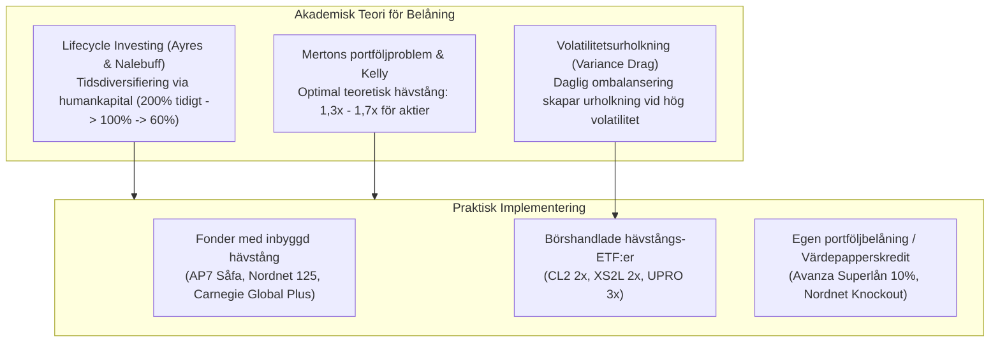
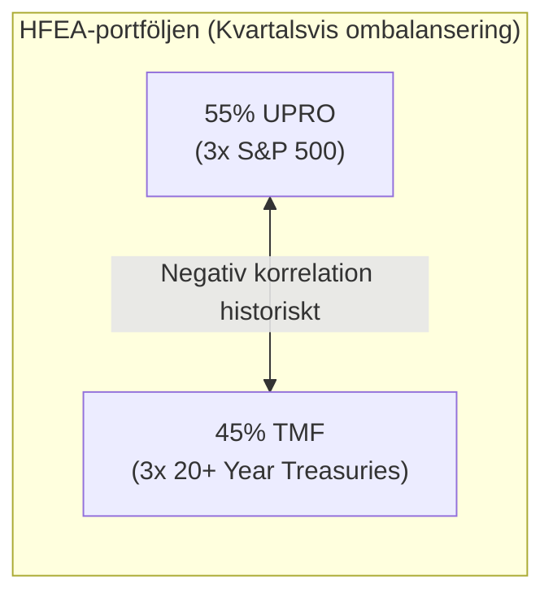
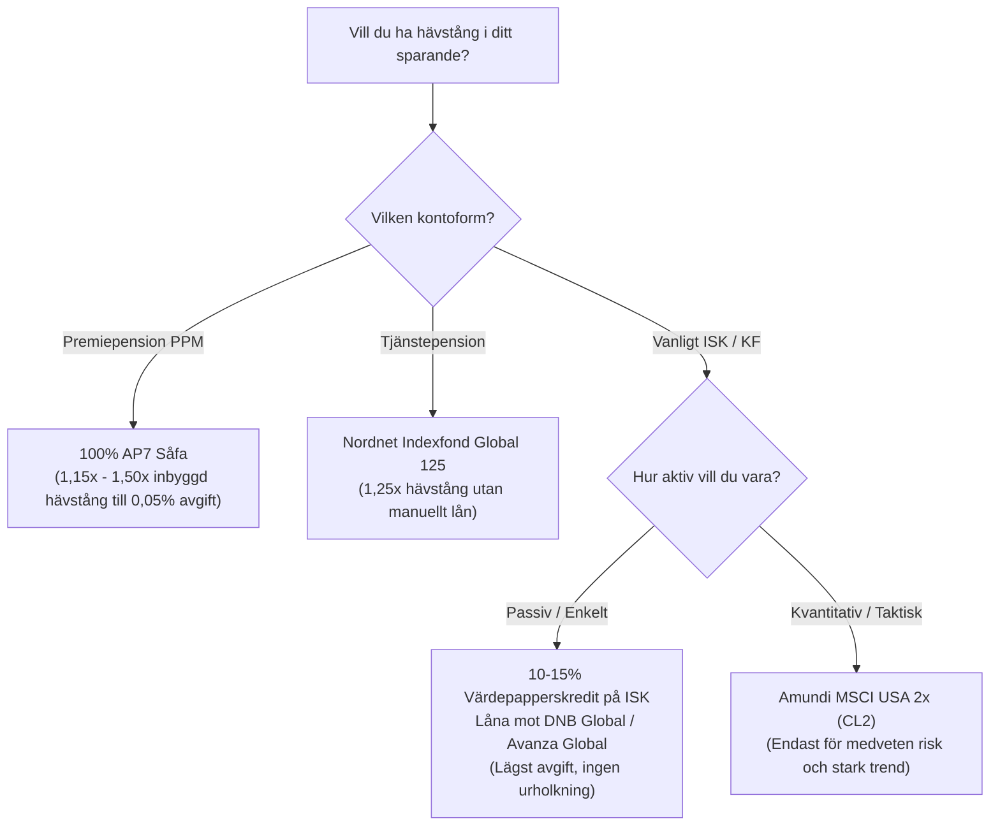

# Research: Belåning och Hävstång i Fonder och ETF:er

Status: Sammanställning av akademisk forskning (*Lifecycle Investing*, Fama-French, Merton), internationella Bogleheads-strategier (*Hedgefundie/HFEA*), samt svenska fonder med inbyggd hävstång och portföljbelåning på RikaTillsammans-forumet.

---

## 1. Executive Summary

Belåning (hävstång) är ett av de mest diskuterade och missförstådda ämnena inom kvantitativ portföljteori och evidensbaserat sparande. 

*   **Den akademiska grunden (*Lifecycle Investing*):** Forskning från Yale-professorerna Ian Ayres och Barry Nalebuff visar att unga sparare har för lite aktieexponering i förhållande till sitt livstidssparande (humankapital). Genom måttlig hävstång (1,2x–2,0x) tidigt i livet kan man **tidsdiversifiera** och uppnå högre slutkapital till lägre total livstidsrisk.
*   **Volatilitetsurholkning (*Volatility Drag / Decay*):** Produkter med **daglig hävstång** (t.ex. 2x eller 3x ETF:er) drabbas av matematisk urholkning i svängiga marknader. Däremot drabbas **fonder med periodisk ombalansering** (t.ex. AP7 Såfa, Nordnet 125) eller **egen värdepapperskredit** inte av samma urholkning.
*   **Svenska fonder med inbyggd hävstång:**
    *   **AP7 Aktiefond / AP7 Såfa:** Statens förval i premiepensionen med 15–50 % hävstång (1,15x–1,50x) via derivat till en exceptionellt låg avgift (~0,05 %). Historiskt en av Sveriges bäst presterande fonder.
    *   **Nordnet Indexfond Global 125 / Montrose 125:** 1,25x hävstång mot MSCI World med månadsvis/bandad ombalansering och låg avgift (~0,40 %).
    *   **Carnegie Global Plus:** ~1,40x hävstång via aktier och derivat, men debatterad på RikaTillsammans p.g.a. hög avgift (~1,20–1,40 %).
*   **Börshandlade hävstångs-ETF:er (UCITS & USA):**
    *   **Amundi MSCI USA 2x Leveraged (CL2):** Den mest populära 2x UCITS-ETF:en i Europa.
    *   **HFEA (*Hedgefundie's Excellent Adventure*):** Den legendariska Bogleheads-strategin (55 % UPRO 3x S&P 500 + 45 % TMF 3x Long Treasuries). Fick katastrofala förluster under räntehöjningarna 2022 och har lett till en förskjutning mot 2x-hävstång eller manuell kredit.
*   **Konsensus på RikaTillsammans-forumet:** Egen måttlig **värdepapperskredit (10–15 % belåning)** med ränterabatt på Avanza/Nordnet slår i regel fonder med inbyggd hävstång. Du kombinerar marknadens billigaste basfond (t.ex. DNB Global på 0,22 % eller Avanza Global på 0,09 %) med en låg rörlig låneränta, slipper fondbolagets förvaltningspåslag och slipper daglig urholkning.

---

## 2. Akademisk teori: Varför och hur fungerar hävstång?

### A. Lifecycle Investing (Ayres & Nalebuff, Yale University, 2010)
Den traditionella rådgivningen ("spara 100 % aktier när du är ung, lägg till räntor när du blir äldre") lider av ett fundamentalt matematiskt fel:
*   En 25-åring har 100 000 kr i sparande och investerar 100 000 kr i aktier. Men personens totala livsförmögenhet domineras av **humankapitalet** (diskonterade framtida löneinkomster på kanske 15–20 miljoner kr). I realiteten har 25-åringen mindre än 1 % av sin totala förmögenhet i aktier.
*   En 60-åring har kanske 5 miljoner kr i sparande och 60 % aktier (3 miljoner kr i aktier), men nästan inget humankapital kvar. Marknadens utfall under de sista 5–10 åren före pension avgör hela pensionen (*Sequence of Returns Risk*).
*   **Slutsats:** Genom att använda hävstång tidigt i livet (t.ex. 2:1 eller 200 % aktieexponering) sprider man aktierisken jämnt över hela livscykeln (**tidsdiversifiering**). Modellen visar att risken för ett katastrofalt dåligt pensionsutfall minskar med ca 20 % jämfört med traditionellt sparande.

---

### B. Mertons portföljproblem och Kelly-kriteriet (Optimal hävstång)
I kontinuerlig tid ges den förväntade geometriska tillväxttakten $g$ för en hävstångsportfölj med hävstång $L$ av:

$$g(L) = r + L(\mu - r) - \frac{1}{2} L^2 \sigma^2$$

Där:
*   $r$ är riskfri ränta / upplåningsränta
*   $\mu - r$ är aktiemarknadens riskpremie (~5 %)
*   $\sigma$ är aktiemarknadens volatilitet (~16–18 %)

Optimal hävstång för att maximera tillväxttakten fås genom att derivera m.a.p. $L$:

$$L^* = \frac{\mu - r}{\sigma^2}$$

Med historiska parametrar ($\mu - r = 0,05$, $\sigma = 0,16$) blir $L^* \approx \frac{0,05}{0,0256} \approx 1,95$.  
Efter upplåningskostnader, förvaltningsavgifter och transaktionskostnader visar forskningen (bl.a. Fama & French, Asness m.fl.) att den optimala långsiktiga hävstången för en bred global aktieportfölj ligger på **mellan 1,2x och 1,5x**. Hävstång över 2,0x (och i synnerhet 3,0x) leder till att kvadratiska volatilitetsförluster ($\frac{1}{2} L^2 \sigma^2$) äter upp den extra avkastningen.

---

### C. Volatilitetsurholkning (*Volatility Drag / Decay*)
Detta är den enskilt viktigaste faktorn att förstå vid hävstång:

1.  **I en trending marknad (stark uppgång):** Daglig hävstång ger en positiv ränta-på-ränta-effekt. Fonden köper mer när det går upp och presterar *bättre* än $L \times \text{index}$.
2.  **I en sidledes eller svängig marknad:** Daglig hävstång tvingar fonden att köpa på toppen och sälja i botten varje dag för att återställa hävstången.
    *   *Exempel:* Om index rör sig +10 % dag 1 och −10 % dag 2 är indexet på: $1,10 \times 0,90 = 0,99$ (−1,0 %).
    *   En 2x daglig hävstång ger +20 % dag 1 och −20 % dag 2: $1,20 \times 0,80 = 0,96$ (−4,0 %).
    *   En 3x daglig hävstång ger +30 % dag 1 och −30 % dag 2: $1,30 \times 0,70 = 0,91$ (−9,0 %).
3.  **Hur undviks urholkning?**
    *   Genom att **inte ombalansera dagligen**. Fonder som ombalanserar månadsvis (t.ex. Nordnet 125) eller sparare som använder **egen portföljbelåning** (där skulden är ett fast kronbelopp) slipper den dagliga matematiska urholkningen.

---

## 3. Fonder med inbyggd hävstång i Sverige

I Sverige finns ett antal fonder som använder finansiella derivat (terminskontrakt) för att uppnå en exponering över 100 %. Dessa diskuteras flitigt på RikaTillsammans-forumet.

| Fondnamn | Målhävstång (Exponering) | Index / Strategi | Total avgift (ca) | Forumstatus & Kommentar |
| :--- | :--- | :--- | :--- | :--- |
| **AP7 Aktiefond** (i AP7 Såfa) | **115–150 %** (f.n. ca 115–125 %) | Globala aktier (MSCI ACWI) | **0,05 %** | **Sveriges tveklöst bästa fond.** Förvaltas av staten inom premiepensionen (PPM). Hävstången anpassas dynamiskt efter marknadsvärderingar. Extremt låg avgift och enastående historisk avkastning. |
| **Nordnet Indexfond Global 125** | **125 %** (1,25x) | MSCI World ESG Leaders | ~0,40 % | **Lågprisvalet med inbyggd hävstång.** Använder terminskontrakt och ombalanserar periodiskt/bandat (ej dagligen), vilket minimerar urholkningseffekten. Mycket populär i tjänstepensionslösningar. |
| **Carnegie Global Plus** *(tidigare OPM Global Quality)* | **~140 %** (1,40x) | Globala kvalitetsbolag + terminer | ~1,20–1,40 % | **Omtalad men ifrågasatt.** Ger hög hävstång (ca 40 % extra), men forumet kritiserar den höga förvaltningsavgiften som äter upp en stor del av överavkastningen. |
| **Montrose Global Leverage 125** | **125 %** (1,25x) | Globalt marknadsindex | ~0,40 % | Nyare utmanare på Montrose-plattformen som erbjuder 1,25x global indexexponering. |
| **Avanza Auto 6** | **~114 %** (1,14x) | Global blandfond / fond-i-fond | ~0,35–0,40 % | Använder ca 14 % hävstång på aktiedelen via derivat. Automatiserat alternativ på Avanza. |

> **Viktig foruminsikt för tjänstepension:**
> I en vanlig depå eller ISK kan du själv välja portföljbelåning. Men i **tjänstepension och privat pensionssparande** är manuell kredit inte tillåten enligt lag. Därför är fonder som **Nordnet Global 125** och **Carnegie Global Plus** särskilt populära på forumet just för tjänstepensionen, där de är det enda sättet att få hävstång.

---

## 4. Börshandlade hävstångs-ETF:er (Leveraged ETFs)

Börshandlade fonder med hävstång har i regel **daglig återställning (daily reset)** och är primärt konstruerade för kortare tidshorisonter, men används ändå av en del långsiktiga kvantitativa investerare.

### A. Europeiska UCITS-godkända hävstångs-ETF:er
Eftersom svenska och europeiska sparare inte kan handla amerikanska ETF:er direkt är följande instrument de mest omsatta i Europa:

| Ticker | Namn | Hävstång | Underliggande index | TER | Replikering |
| :--- | :--- | :--- | :--- | :--- | :--- |
| **CL2** (Euronext) | *Amundi MSCI USA Daily (2x) Leveraged UCITS ETF* | **2x Daglig** | MSCI USA | 0,50 % | Syntetisk (Swap) |
| **XS2L / DBPG** (Xetra) | *Xtrackers S&P 500 2x Leveraged Daily Swap UCITS ETF* | **2x Daglig** | S&P 500 | 0,60 % | Syntetisk (Swap) |
| **3USL** (LSE/Xetra) | *WisdomTree S&P 500 3x Daily Leveraged* | **3x Daglig** | S&P 500 | 0,75 % | ETP (Skuldförbindelse) |
| **QQQ3** (LSE/Xetra) | *WisdomTree NASDAQ 100 3x Daily Leveraged* | **3x Daglig** | NASDAQ-100 | 0,75 % | ETP (Skuldförbindelse) |
| **XACT Bull / Bull 2** | *XACT Bull / XACT Bull 2 (Stockholmsbörsen)* | **1,5x / 2x** | OMXS30 | ~0,60 % | Derivat på svenska storbolag |

---

### B. Bogleheads-legenden: HFEA (*Hedgefundie's Excellent Adventure*)

På det amerikanska Bogleheads-forumet startade användaren "HEDGEFUNDIE" 2019 en tråd som blev en av forumets mest lästa någonsin:

*   **Teorin:** Aktier och långa statsobligationer rör sig ofta i motsatt riktning vid börskrascher (*Flight to Safety*). Genom att belåna båda tillgångarna 3x och ombalansera kvartalsvis skapas en våldsam "ombalanseringsturbomaskin" som säljer det som rusat och köper det som fallit.
*   **Resultat 2010–2021:** Portföljen gav fenomenal avkastning (flera tusen procent under 10 år).
*   **Stresstestet 2022 (Kraschen):**
    *   Under 2022 steg inflationen kraftigt och centralbankerna höjde räntorna i rekordtakt.
    *   Både aktier (S&P 500) och långa obligationer föll kraftigt samtidigt.
    *   **TMF rasade med över 80 %**, samtidigt som UPRO föll med över 50 %. HFEA-portföljen förlorade närmare **70–80 % av sitt värde**.
*   **Lärdomar på Bogleheads och Rational Reminder:**
    1.  **3x hävstång har dödlig svansrisk:** När aktier och räntor faller samtidigt finns inget skydd.
    2.  **Upplåningskostnaden:** Hävstångs-ETF:er lånar till korta marknadsräntor (SOFR/Fed Funds). När räntan steg från 0 % till 5 % blev fondens interna räntekostnad 10–15 % per år för 3x exponering!
    3.  **Modern Bogleheads-konsensus kring HFEA:** De flesta förespråkar numera **max 2x hävstång** (t.ex. *SSO* 2x S&P 500 + *UBT* 2x Treasuries, eller CL2 i Europa) eller att helt undvika 3x-produkter för långsiktigt sparande.

---

## 5. Egen portföljbelåning (Värdepapperskredit) vs. Hävstångsfonder

På RikaTillsammans-forumet har debatten under ledning av kvantitativa forumanvändare (bl.a. "Zino") landat i en tydlig jämförelse mellan att köpa fonder med inbyggd hävstång och att använda **nätmäklarnas värdepapperskredit**.

### A. Så fungerar värdepapperskredit på ISK (Avanza & Nordnet)
Genom att aktivera värdepapperskredit på ditt ISK kan du låna pengar med dina befintliga fonder som säkerhet. 

*   **Avanza Ränterabatt (Superlånet):**
    *   Om du lånar **max 10 %** av portföljens värde i godkända fonder (t.ex. DNB Global Indeks, Länsförsäkringar Global) får du den lägsta ränterabatten (ofta styrräntan minus rabatt, t.ex. runt 2,5–3,5 % rörlig ränta).
    *   Vid 10–25 % belåning stiger räntan till nästa rabattsteg.
*   **Nordnet Knockout-lånet:**
    *   Liknande trappstegsmodell där godkända fonder ger låg ränta vid låg belåningsgrad (upp till 15–20 %).

---

### B. Jämförelse: Egen belåning vs. Inbyggd fondhävstång

| Egenskap | Egen Värdepapperskredit (t.ex. 10–15 % på ISK) | Fond med inbyggd hävstång (t.ex. Carnegie / Nordnet 125) | Leveraged ETF (t.ex. CL2 2x) |
| :--- | :--- | :--- | :--- |
| **Valfrihet av tillgångar** | **Maximal.** Du kan belåna marknadens billigaste basfonder (DNB Global 0,22 % eller Avanza Global 0,09 %). | **Låg.** Du är låst till förvaltarens fond och metodik. | **Måttlig.** Låst till specifika index (ofta S&P 500 eller MSCI USA). |
| **Löpande fondavgift** | **0,09–0,22 %** (ingen extra förvaltningsavgift för hävstången). | **0,40–1,40 %** (förvaltaren tar betalt för derivathanteringen). | **0,50–0,75 %** TER. |
| **Finansieringsränta** | Rörlig utlåningsränta (efter ränterabatt hos nätmäklaren). | Fondens interna terminsränta (ofta STIBOR/SOFR + spread). | Fondens interna ränta (SOFR/EURIBOR + swap-spread). |
| **Volatilitetsurholkning** | **INGEN.** Lånet är ett fast kronbelopp. Om marknaden svänger upp och ner förlorar du inget på matematisk urholkning. | **Låg/Måttlig.** Månadsvis ombalansering ger marginell urholkning. | **HÖG.** Daglig ombalansering urholkar kapitalet i slagig marknad. |
| **Risk för tvångsförsäljning (*Margin Call*)** | **Finns teoretiskt.** Men vid 10 % belåning krävs ett börsfall på över **80–85 %** innan tvångsförsäljning sker. | **Ingen.** Fonden hanterar säkerhetskraven internt. Du kan aldrig bli skyldig pengar. | **Ingen.** Du kan maximalt förlora det investerade kapitalet. |
| **Tjänstepension & PPM** | **Ej tillåten enligt lag.** | **Tillåten.** Det enda sättet att få hävstång i tjänstepensionen! | Sällan tillgänglig i tjänstepension. |

---

## 6. Risker och Tumregler för Hävstång

Både forumkonsensus på RikaTillsammans och akademisk forskning varnar för att hävstång är ett tveeggat svärd som förstärker både upp- och nedgångar:

1.  **Hävstång ökar risken för beteendemisstag:** En portfölj med 1,4x hävstång faller med 70 % när börsen faller 50 %. De flesta människor klarar psykologiskt inte av att se sitt livsbesparingar rasa så djupt utan att få panik och sälja på botten.
2.  **Räntekostnaden måste understiga avkastningen:** När räntorna stiger minskar den förväntade riskpremien från hävstång. Om låneräntan är 5 % och börsens förväntade avkastning är 7 % är den förväntade vinsten av hävstången endast 2 % – till dubbel volatilitet!
3.  **Den gyllene regeln för portföljbelåning (10–15 %):**
    *   Håll dig alltid inom nätmäklarens **lägsta ränterabatt (max 10–15 % belåning)**.
    *   Vid 10 % belåning har du en enorm säkerhetsmarginal mot margin calls även vid historiska krascher (typ 1929 eller 2008).

---

## 7. Slutsatser och Sammanfattande Rekommendationer

1.  **I Premiepensionen (PPM):** Välj **AP7 Såfa**. Du får en global portfölj med statens inbyggda hävstång till en kostnad på endast 0,05 %. Detta är Sveriges mest förmånliga finansiella produkt.
2.  **I Tjänstepensionen:** Om ditt avtal tillåter det, är **Nordnet Indexfond Global 125** (eller Montrose 125) det mest rationella sättet att applicera *Lifecycle Investing* tidigt i karriären, eftersom manuell värdepapperskredit inte är tillåten i pensionsskalet.
3.  **På privat ISK / KF:** 
    *   **Undvik dyra fonder med inbyggd hävstång:** Att betala 1,4 % i avgift för Carnegie Global Plus är kontraproduktivt.
    *   **Välj egen portföljbelåning på max 10–12 %:** Köp **DNB Global Indeks S** eller **Avanza Global** och aktivera värdepapperskrediten till lägsta ränterabatt. Du får ca 1,12x hävstång helt utan daglig urholkning och till minimal totalkostnad.
4.  **Kring 3x ETF:er (UPRO, TQQQ, 3USL):** Bogleheads och RikaTillsammans avråder bestämt från 3x hävstångsprodukter som "buy-and-hold"-investeringar p.g.a. extrem volatilitetsurholkning och risk för permanenta kapitalförluster i inflations- och räntechocker.

---

## Källor och Referenser
- **Akademiska publikationer:**
  - Ayres, I., & Nalebuff, B. (2010). *Lifecycle Investing: A New, Safe, and Audacious Way to Improve the Performance of Your Retirement Portfolio*. Basic Books.
  - Merton, R. C. (1969). *Lifetime Portfolio Selection under Uncertainty: The Continuous-Time Case*. The Review of Economics and Statistics.
  - Asness, C. S., Frazzini, A., & Pedersen, L. H. (2012). *Leverage Aversion and Risk Parity*. Financial Analysts Journal.
- **Bogleheads Forum:**
  - HEDGEFUNDIE (2019–2026): *HEDGEFUNDIE's Excellent Adventure* (UPRO/TMF portfolio strategy thread).
- **RikaTillsammans Forum:**
  - Forumtrådar: *Carnegie Global Plus vs Nordnet 125*, *Zinos modell för optimal portföljbelåning*, *Hävstång i tjänstepensionen*.
- **Produktfaktablad och prospekt:**
  - Sjunde AP-fonden: *AP7 Aktiefond Faktablad & Placeringsregler för hävstång*.
  - Nordnet: *Nordnet Indexfond Global 125 Faktablad (KID)*.
  - Amundi: *Amundi MSCI USA Daily (2x) Leveraged UCITS ETF (CL2) KID*.
