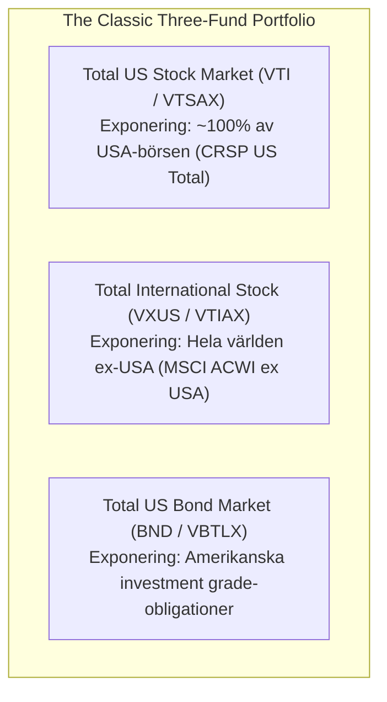
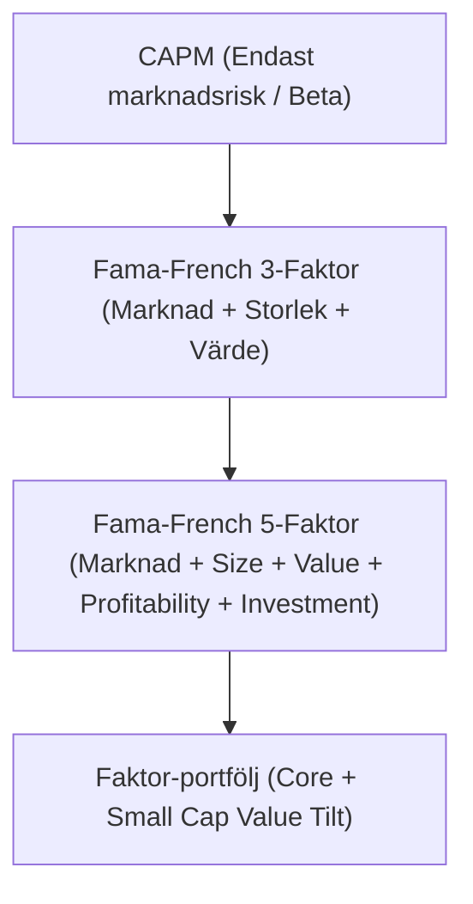
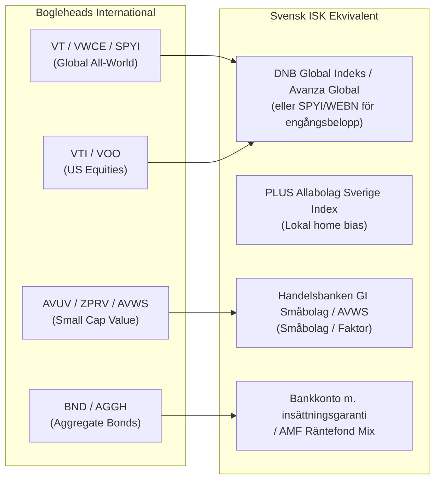

# Internationell Index- och ETF-research: Bogleheads, Rational Reminder och den Globala Evidensrörelsen

Status: Djupgående sammanställning av principer, modellportföljer och de mest rekommenderade instrumenten på internationella forum (Bogleheads US, Bogleheads Non-US/EU, Rational Reminder och relaterade communityn), samt en jämförande analys mot den svenska investeringsmiljön.

---

## 1. Executive Summary

Internationellt domineras det evidensbaserade småspararlandskapet av **Bogleheads** (uppkallat efter Vanguards grundare John C. Bogle) och **Rational Reminder**-communityn (lett av Ben Felix och Cameron Passmore vid PWL Capital).

*   **Bogleheads-kärnan:** Förespråkar en strikt marknadsviktad, passiv lågkostnadsstrategi. Standardmodellen i USA är **"The Three-Fund Portfolio"** (VTI + VXUS + BND) eller den förenklade **"VT and chill"** (Total World Stock).
*   **Europeiska Bogleheads (UCITS-universumet):** P.g.a. EU-reglering (PRIIPs/KID) och amerikanska skattefällor (US Estate Tax och 30 % källskatt) investerar icke-amerikaner uteslutande i **irländska (IE) UCITS-ETF:er**. Det europeiska standardmantrat är **"VWCE and chill"** (Vanguard FTSE All-World, ackumulerande), men utmanas kraftigt av lågprisutmanarna **SPYI** (SPDR MSCI ACWI IMI, 0,17 % inkl. småbolag) och **WEBN** (Amundi Prime All Country World, 0,07 %).
*   **Rational Reminder / Faktorinvestering:** För mer avancerade investerare kompletteras marknadsvikten med systematiska faktor-tilts baserade på Fama-French 5-faktormodellen. Förstahandsvalet är **Small Cap Value (SCV)** via **Avantis** (AVUV/AVDV i USA; nylanserade **AVWS** i Europa) samt **SPDR** (ZPRV/ZPRX).
*   **Brobyggnad till Sverige:** Medan internationella Bogleheads nästan uteslutande använder ETF:er p.g.a. dåligt lokalt fondutbud, har svenska sparare tillgång till exceptionellt billiga, courtagefria **traditionella indexfonder** (DNB Global Indeks, Avanza Global, PLUS Allabolag). För en svensk ISK-sparare är dessa fonder ofta mer kostnadseffektiva för löpande månadssparande än utländska ETF:er p.g.a. valutaväxlingsavgifter (0,25 %) och courtage.

---

## 2. Bogleheads-filosofin och dess kärnprinciper

Bogleheads filosofi kan sammanfattas i ett tiotal gyllene regler:
1.  **Utveckla en fungerande plan:** Bestäm tillgångsallokering (aktier vs. räntor) utifrån sparhorisont och risktolerans.
2.  **Investera tidigt och regelbundet:** Ränta-på-ränta-effekten kräver tid.
3.  **Ta inte för mycket eller för lite risk:** Blanda tillgångsslag för att undvika panikförsäljning vid krascher.
4.  **Bred diversifiering:** *"Don't look for the needle in the haystack, just buy the entire haystack."*
5.  **Försök aldrig tajma marknaden:** Marknadstajming är ett förlorarspel för 99 % av alla investerare.
6.  **Använd indexfonder:** Aktiva förvaltare underpresterar konsekvent efter avgifter (SPIVA-data).
7.  **Minimera kostnader:** Varje krona/dollar i avgift tas direkt från din framtida avkastning.
8.  **Minimera skatter:** Placera tillgångar i skatteeffektiva skal och fonder.
9.  **Håll det enkelt:** Enkelhet slår komplexitet (*The majesty of simplicity*).
10. **Håll kursen (*Stay the course*):** Ändra inte strategi när marknaden skakar eller media ropar varg.

---

## 3. Det amerikanska Bogleheads-ekosystemet (US Bogleheads)

I USA är investerare inte begränsade av EU:s regelverk och har tillgång till världens mest likvida och billiga ETF:er och värdepapper.

### A. Den klassiska "Three-Fund Portfolio"
Portföljmodellen skapades av Bogleheads-medlemmen Taylor Larimore och bygger på tre breda index:

#### Vanguard-byggstenar:
*   **VTI** (*Vanguard Total Stock Market ETF*, TER 0,03 %) / **VTSAX** (fond): Följer CRSP US Total Market Index (~3 700 bolag: Large, Mid, Small, Micro Cap).
*   **VXUS** (*Vanguard Total International Stock ETF*, TER 0,07 %) / **VTIAX** (fond): Följer FTSE Global All Cap ex US Index (~8 500 bolag i utvecklade och tillväxtmarknader exklusive USA).
*   **BND** (*Vanguard Total Bond Market ETF*, TER 0,03 %) / **VBTLX** (fond): Följer Bloomberg U.S. Aggregate Float Adjusted Index.

#### Fidelity ZERO-alternativen (Avgift 0,00 %):
Fidelity erbjuder mutual funds med noll i avgift (dock proprietära och ej flyttbara utan skattehändelse):
*   **FZROX** (*Fidelity ZERO Total Market Index Fund*, 0,00 %)
*   **FZILX** (*Fidelity ZERO International Index Fund*, 0,00 %)
*   **FXNAX** (*Fidelity U.S. Bond Index Fund*, 0,025 %)

#### Schwab-alternativen:
*   **SWTSX** (*Schwab Total Stock Market Fund*, 0,03 %)
*   **SWISX** (*Schwab International Index Fund*, 0,06 %)
*   **SWAGX** (*Schwab U.S. Aggregate Bond Index Fund*, 0,04 %)

---

### B. Den stora Bogleheads-debatten: VTI vs. VXUS (Market-Cap vs. Home Bias)

En av de mest aktiva och återkommande debatterna på `bogleheads.org/forum` gäller fördelningen mellan amerikanska och internationella aktier:

1.  **Global marknadsvikt (~60 % US / 40 % ex-US):**
    *   *Förespråkare:* Forskningen (CAPM/EMH) dikterar att marknadsvikt är den mest neutrala och diversifierade portföljen. Allt annat är en aktiv satsning på ett specifikt land.
    *   *Instrument:* **VT** (*Vanguard Total World Stock ETF*, TER 0,07 %) som sköter ombalanseringen automatiskt ("VT and chill").
2.  **Måttlig Home Bias (~70–80 % US / 20–30 % ex-US):**
    *   *Förespråkare:* Många amerikanska Bogleheads väljer att övervikta USA p.g.a. valutatrygghet (konsumerar i USD), starkare bolagsstyrning och reglering, samt lägre politisk risk.
3.  **100 % US Equity (Jack Bogles skola):**
    *   *Förespråkare:* Jack Bogle själv ansåg fram till sin bortgång att internationella aktier var onödiga. Hans argument var att stora amerikanska bolag (S&P 500) redan får ~40 % av sina intäkter utomlands, samt att utländska marknader historiskt haft högre risk och sämre aktieägarfokus.
    *   *Motargument på forumet:* Historien visar att USA och internationella marknader växlar ledarskap i cykler om 10–15 år (t.ex. 1970-talet och 2000–2009 då internationella aktier slog USA kraftigt). Att utesluta ex-US innebär onödig koncentrationsrisk.

---

### C. VOO (S&P 500) vs. VTI (Total US Market)

En annan klassisk diskussion på forumet och r/Bogleheads:
*   **VOO** (S&P 500, ~500 bolag) utgör ca 80–85 % av marknadsvärdet i **VTI** (~3 700 bolag).
*   Korrelationen mellan VOO och VTI är extremt hög (>0,99).
*   *Forumkonsensus:* VTI föredras principiellt enligt Bogleheads-doktrinen (inkluderar små- och medelstora bolag), men om en investerares arbetsgivare (401k) endast erbjuder S&P 500 är VOO en fullgod ersättare.

---

## 4. Det europeiska och internationella Bogleheads-ekosystemet (UCITS)

För icke-amerikanska investerare (inklusive européer) kan en direkt kopiering av den amerikanska portföljen (VTI/VXUS) leda till allvarliga regulatoriska och skattemässiga konsekvenser.

### A. Varför européer INTE kan köpa amerikanska ETF:er
1.  **PRIIPs / MiFID II-regler:** Sedan 2018 kräver EU-lagstiftning att fonder som säljs till icke-professionella sparare tillhandahåller ett standardiserat faktablad (KID - Key Information Document) på det lokala språket. Amerikanska emittenter (Vanguard US, BlackRock US) producerar inte KID för amerikanska ETF:er. Europeiska mäklare blockerar därför köpordrar av VTI/VOO/BND.
2.  **Amerikansk arvsskatt (*US Estate Tax Trap*):** Utländska medborgare som äger amerikanska tillgångar (US-situs assets, såsom aktier noterade i USA och amerikanska ETF:er) drabbas av amerikansk federal arvsskatt på upp till **40 %** på värden som överstiger ett fribelopp på endast **$60 000** vid dödsfall.
3.  **Källskatt på utdelningar (*Withholding Tax*):** USA drar 30 % källskatt på utdelningar till utländska investerare om inte särskilt skatteavtal finns.

### B. Lösningen: Irländska (IE) UCITS-ETF:er
Bogleheads-gemenskapen utanför USA har sammanställt omfattande guider (bl.a. *Non-US investor's guide to navigating US tax traps*):
*   **Irland-domicil (ISIN: IE...):** Irland har ett förmånligt skatteavtal med USA som sänker källskatten på utdelningar från amerikanska bolag till **15 %** på fondnivå (Level 1).
*   **Ingen irländsk källskatt:** Irland tar 0 % källskatt på utdelningar från irländska UCITS-fonder till icke-irländska investerare (Level 2).
*   **Ackumulerande fonder (Acc):** Fonder som automatiskt återinvesterar utdelningar internt i fonden. I många europeiska länder slipper man därmed utdelningsskatt vid varje utbetalning och slipper manuellt återinvesteringsarbete.

---

### C. "VWCE and chill" – Europas mest kända Bogleheads-strategi

På europeiska forum (r/Bogleheads, r/EuropeanFIRE, Bogleheads Non-US) är **"VWCE and chill"** den oomtvistade referenspunkten.

*   **Ticker:** **VWCE** (noterad på Xetra i EUR) / **VWRA** (noterad på LSE i USD)
*   **Namn:** *Vanguard FTSE All-World UCITS ETF (USD) Accumulating*
*   **ISIN:** IE00BK5BQT80
*   **Index:** FTSE All-World Index (~3 700 bolag, Large & Mid Cap i Developed och Emerging Markets)
*   **TER:** 0,22 % (tidigare diskuterat ner mot 0,14 % i priskonkurrens)
*   **AUM:** Gigantiskt (>10 miljarder EUR), extremt snäva spreads och hög likviditet.

**Filosofin:** Istället för en tre-fondsportfölj har européer "kollapsat" aktiedelen till en enda fond. VWCE sköter ombalanseringen mellan USA, Europa, Asien och tillväxtmarknader helt automatiskt efter flytande marknadsvikt.

---

### D. Avgiftskriget i Europa: Utmanarna till VWCE

Under 2023–2026 har flera konkurrenter lanserat breda globala ETF:er med lägre avgifter för att utmana Vanguards dominans. Forumet diskuterar intensivt följande fyra alternativ:

| Ticker | Emittent | Fullständigt namn | Index | TER | Exponering / Bredd | Bogleheads-bedömning |
| :--- | :--- | :--- | :--- | :--- | :--- | :--- |
| **VWCE** | Vanguard | Vanguard FTSE All-World UCITS ETF (Acc) | FTSE All-World | 0,22 % | Large & Mid Cap (~3 700 bolag). DM + EM. | **Guldstandarden.** Högst anseende, pålitlig tracking, gigantisk AUM. Förstahandsvalet för de flesta. |
| **SPYI** | SPDR | SPDR MSCI ACWI IMI UCITS ETF (Acc) | MSCI ACWI IMI | 0,17 % | Large, Mid & **Small Cap** (~9 000 bolag i index, ~3 500 fysiskt hållna). DM + EM + SC. | **Bredaste alternativet.** Inkluderar småbolag, vilket gör den metodologiskt närmare en sann global all-cap. Lägre avgift än VWCE. |
| **WEBN** | Amundi | Amundi Prime All Country World UCITS ETF (Acc) | Solactive GBS Global Markets All Cap | **0,07 %** | Large, Mid & Small Cap (Solactive-metodik). DM + EM. | **Lågprisvinnaren.** Skakade om marknaden med 0,07 % TER. Debatteras pga Solactive-index (mindre beprövat än FTSE/MSCI) och Amundis historik av fondfusioner. |
| **FWRA** | Invesco | Invesco FTSE All-World UCITS ETF (Acc) | FTSE All-World | 0,15 % | Large & Mid Cap. Samma index som VWCE. | **Direkt kopia.** Lanserades specifikt för att underbjuda VWCE på samma index. Något lägre AUM. |

---

### E. Det klassiska två-fonds-alternativet: IWDA + EMIM (Core Developed + EM)

Innan VWCE lanserades och fick stor spridning var standardlösningen för europeiska Bogleheads en två-fonds-kombination från iShares:
*   **IWDA / SWDA** (*iShares Core MSCI World UCITS ETF*, TER 0,20 %): Täcker enbart utvecklade marknader (Developed Markets).
*   **EMIM / EIMI** (*iShares Core MSCI EM IMI UCITS ETF*, TER 0,18 %): Täcker tillväxtmarknader inklusive småbolag.

**Traditionell fördelning:** 88 % IWDA + 12 % EMIM (motsvarar global marknadsvikt).

*   *Fördelar:* Möjliggör manuell styrning av tillväxtmarknadsexponeringen; historiskt marginellt lägre vägd avgift.
*   *Nackdelar:* Kräver manuell ombalansering och medför fler transaktionskostnader. De flesta nya Bogleheads väljer idag en allt-i-ett-fond (VWCE, SPYI eller WEBN).

---

### F. Räntekomponenten i Europa

För Bogleheads som vill ha räntor i portföljen (t.ex. en 80/20 eller 60/40-allokering) gäller strikta principer för icke-amerikaner:

1.  **Valutasäkring är obligatorisk för räntebärande värdepapper:**
    *   Aktier kan vara ohedgade mot EUR/SEK eftersom aktiers volatilitet domineras av bolagens fundamentala värdeutveckling över 10–20 år.
    *   Räntor ska fungera som krockkudde. Att äga ohedgade utländska obligationer (t.ex. US Treasuries) innebär att valutakursfluktuationer överskuggar obligationens ränteavkastning.
2.  **Standardinstrument:**
    *   **AGGH / EUNA** (*iShares Core Global Aggregate Bond UCITS ETF EUR Hedged*, TER 0,10 %): Följer Bloomberg Global Aggregate Index med valutasäkring till EUR.
    *   **VAGF** (*Vanguard Global Aggregate Bond UCITS ETF EUR Hedged*, TER 0,10 %): Vanguards direkta motsvarighet.
    *   **XEON** (*Xtrackers II EUR Overnight Rate Swap UCITS ETF*, TER 0,10 %): Följer €STR (euro short-term rate), används flitigt i Europa som likviditetsplacering/ränteersättare.

---

## 5. Rational Reminder & Faktorinvestering (Fama-French)

I communityn runt podcasten *Rational Reminder* (Ben Felix och Cameron Passmore) och på subforum för evidensbaserad portföljteori tas Bogleheads-filosofin ett steg längre genom **faktorinvestering**.

### A. Varför Small Cap Value (SCV)?
Enligt Fama och Frenchs forskning (1992, 2015) förklaras aktiers avkastning inte bara av marknadsrisk, utan av fem systematiska faktorer:
1.  **Market (Beta):** Aktiemarknaden överavkastar riskfri ränta.
2.  **Size (SMB - Small Minus Big):** Småbolag har högre förväntad avkastning än stora bolag.
3.  **Value (HML - High Minus Low):** Billiga bolag (lågt P/B, P/E) överavkastar dyra tillväxtbolag.
4.  **Profitability (RMW - Robust Minus Weak):** Bolag med hög operativ lönsamhet överavkastar bolag med svag lönsamhet.
5.  **Investment (CMA - Conservative Minus Aggressive):** Bolag som investerar återhållsamt överavkastar bolag som investerar aggressivt.

*Slutsats i forskningen:* Rena småbolag (Small Cap Blend) presterar historiskt dåligt p.g.a. att kategorin innehåller olönsamma tillväxtbolag ("small cap growth lottery tickets"). Den verkliga premien uppstår i **Small Cap Value med hög lönsamhet**.

---

### B. Faktor-instrument i USA: Avantis-dominansen

Under ledning av Eduardo Repetto (tidigare Co-CEO på Dimensional Fund Advisors) grundades **Avantis Investors** (under American Century Investments). De dominerar diskussionerna på Rational Reminder:
*   **AVUV** (*Avantis U.S. Small Cap Value ETF*, TER 0,25 %): Det mest rekommenderade instrumentet i USA för att fånga amerikansk SCV-premie med lönsamhetsfilter.
*   **AVDV** (*Avantis International Small Cap Value ETF*, TER 0,36 %): Samma metodik för internationella utvecklade marknader.
*   **AVES** (*Avantis Emerging Markets Value ETF*, TER 0,36 %): Värdefokus i tillväxtmarknader.

---

### C. Faktor-instrument i Europa (UCITS)

Europeiska investerare hade länge svårt att hitta bra faktor-ETF:er. Standardverktygen har varit:
*   **ZPRV** (*SPDR MSCI USA Small Cap Value Weighted UCITS ETF*, TER 0,30 %): Amerikanska småbolag viktade efter fundamentala värdeparametrar.
*   **ZPRX** (*SPDR MSCI Europe Small Cap Value Weighted UCITS ETF*, TER 0,30 %): Europeisk motsvarighet.
*   **JPGL** (*JPMorgan Global Equity Multi-Factor UCITS ETF*, TER 0,20 %): Multifaktorfond över hela världen.

#### Det stora genombrottet: Avantis UCITS-lansering (Hösten 2024 / 2026)
Den 25 september 2024 lanserade Avantis officiellt sina första UCITS-ETF:er i Europa:
*   **AVWS** (*Avantis Global Small Cap Value UCITS ETF*, TER 0,39 %, ISIN IE00034YBzg4): En global Small Cap Value ETF för utvecklade marknader med systematiskt lönsamhetsfilter. Har blivit den nya referenspunkten för europeiska faktorinvesterare.
*   **AVWC** (*Avantis Global Equity UCITS ETF*, TER 0,22 %): En bred global aktiefond med inbyggd tilt mot värde och hög lönsamhet.

> **Ben Felix varning om "Tracking Error Regret":**
> På Rational Reminder understryks alltid: Faktorinvestering är endast för investerare med extrem disciplin och en tidshorisont på 20–30 år. Faktorer kan underprestera marknadsindex under 10–15 år i sträck (vilket hände under 2010-talets tech-rally). Om du inte kan hålla fast vid strategin när marknaden slår dig, är en ren marknadsviktad fond (**VWCE/VTI**) alltid ett överlägset val.

---

## 6. Jämförande analys: Bogleheads vs. RikaTillsammans (Sverige)

Både RikaTillsammans och Bogleheads delar exakt samma intellektuella grund. Jan Bolmeson har upprepade gånger hänvisat till Jack Bogle som sin största inspirationskälla. Det finns dock avgörande skillnader i hur strategin implementeras i praktiken på grund av skatter och marknadsstruktur:

| Dimension | Bogleheads (USA / Europa) | RikaTillsammans / Sverige | Orsak till skillnad |
| :--- | :--- | :--- | :--- |
| **Huvudsakligt instrument** | **ETF:er** (VTI, VXUS, VWCE, SPYI) | **Traditionella indexfonder** (DNB Global, LF Global, Avanza Global, PLUS Allabolag) | I Sverige har traditionella fonder 0 kr i courtage och 0 kr i valutaväxling, medan utländska ETF:er beläggs med 0,25 % FX-avgift hos Avanza/Nordnet. |
| **Hemmamarknadsbias (Home Bias)** | USA: 60–80 % i hemmamarknad. Europa: 0–10 % i hemlandet. | Rekommenderas **0–20 %** i Sverige (PLUS Allabolag Sverige). | Sverige utgör endast ~1 % av världsmarknaden. En övervikt på 10–20 % motiveras av valuta- och levnadskostnader i SEK, men inte mer. |
| **Skattestruktur** | Komplex: 401(k), Roth IRA, Taxable, Vorabpauschale (DE), TOB (BE). Ackumulerande fonder föredras starkt. | **ISK och Kapitalförsäkring (KF).** Schablonbeskattat. Extremt enkelt och friktionsfritt oavsett utdelningar. | ISK eliminerar deklarationskrångel kring utdelningar och reavinstskatt helt. |
| **Månadssparande** | I USA: Automatiserat i mutual funds eller fraktions-ETF:er. I Europa: Svårt via traditionella mäklare (hela andelar krävs). | **Helautomatiskt.** Autogiro dras direkt in i valda fonder med fraktionsandelar utan transaktionskostnad. | Den svenska fondinfrastrukturen är exceptionellt väl anpassad för småsparare. |
| **Fondrobot** | Mindre prominent i Bogleheads-forumet (investerare bygger själva via Vanguard/Schwab). | **LYSA** är den officiella förstahandsrekommendationen för nybörjare och passiva sparare. | Fondrobotar i Sverige ger automatisk ombalansering och bra riskspridning till en total avgift på ca 0,35–0,40 %. |

---

## 7. Mappning: Internationella Bogleheads-instrument till Svenska alternativ

För en sparare som läser internationella böcker och forum och vill översätta Bogleheads-principerna till svenska förhållanden finns följande direkta ekvivalenter:

### Översättningstabell för portföljbyggaren

| Bogleheads-koncept | Internationellt ETF-val (US / UCITS) | Bästa Svenska Fondalternativ (Avgiftsfritt köp) | Alternativt Svenskt ETF-val (Större kapital) |
| :--- | :--- | :--- | :--- |
| **Global Marknadsvikt (Core)** | VTI + VXUS (US) VWCE / FWRA (UCITS) | **DNB Global Indeks S** (~0,22 %) **Avanza Global** (~0,09 %) | **SPYI** (0,17 %) **WEBN** (0,07 %) |
| **Hela världen inkl. EM & SC** | VT (US) SPYI (UCITS) | **Storebrand Global All-Countries** (~0,31 %) + Handelsbanken GI Småbolag | **SPYI** (SPDR ACWI IMI) |
| **Home Bias / Hemmamarknad** | VTI (för amerikaner) | **PLUS Allabolag Sverige Index** (~0,22 %) | **XACT Sverige UCITS ETF** (~0,15 %) |
| **Tillväxtmarknader (EM)** | VXUS / VWO (US) EMIM / EIMI (UCITS) | **Avanza Emerging Markets** (~0,27 %) Länsförsäkringar Tillväxtmarknad (~0,40 %) | **iShares Core MSCI EM IMI** (0,18 %) |
| **Small Cap Value (Tilt)** | AVUV / AVDV (US) ZPRV / ZPRX (UCITS) | *(Ingen ren SCV-fond finns i Sverige; Handelsbanken GI Småbolag är Blend)* | **AVWS** (Avantis Global SCV, 0,39 %) **ZPRV** (SPDR USA SCV, 0,30 %) |
| **Obligationer / Krockkudde** | BND / AGGH (UCITS) | **Sparkonto med insättningsgaranti** AMF Räntefond Kort / Mix | **AGGH** (EUR-hedged) |

---

## 8. Slutsats och Praktiska Rekommendationer

1.  **För den pragmatiske svenske spararen (Månadssparande):**
    *   Följ Bogleheads grundregel om total marknadstäckning, men använd Sveriges unika fondstruktur:
        *   **80 % DNB Global Indeks S** (eller Avanza Global)
        *   **20 % PLUS Allabolag Sverige Index**
    *   Detta ger en portfölj med extremt låg avgift (~0,15–0,22 %), noll transaktionskostnader, noll valutaspread och automatiserad ombalansering via nysparande.
2.  **För spararen med stort engångskapital eller FIRE-ambitioner:**
    *   Om kapitalet placeras i en klumpsumma (där 0,25 % valutaväxling betalas en enda gång):
        *   **SPYI** (SPDR MSCI ACWI IMI, 0,17 %) eller **WEBN** (Amundi Prime All-Country, 0,07 %) ger maximal internationell bredd och mycket låga löpande förvaltningskostnader över 15–20 år.
3.  **För den evidensbaserade faktornörden (Rational Reminder-stilen):**
    *   **70 % Global marknadsbas:** DNB Global Indeks / WEBN / SPYI
    *   **20 % Small Cap Value:** AVWS (Avantis Global Small Cap Value UCITS ETF)
    *   **10 % Home bias:** PLUS Allabolag Sverige

---

## Källor och Vidare Läsning
- **Bogleheads Wiki:**
  - [Three-fund portfolio](https://www.bogleheads.org/wiki/Three-fund_portfolio)
  - [Simple non-US portfolios](https://www.bogleheads.org/wiki/Simple_non-US_portfolios)
  - [Non-US investor's guide to navigating US tax traps](https://www.bogleheads.org/wiki/Non-US_investor%27s_guide_to_navigating_US_tax_traps)
- **Rational Reminder Podcast & PWL Capital Research:**
  - Ben Felix: *Five-Factor Investing with ETFs* & model portfolio white papers.
  - Fama, E. F., & French, K. R. (2015). *A five-factor asset pricing model*. Journal of Financial Economics.
- **Vanguard Research & ETF Prospekt:**
  - Vanguard FTSE All-World UCITS ETF (VWCE) Factsheets.
  - Vanguard FTSE Global All-Cap UCITS ETF Prospectus (2026).
- **SPDR & Amundi ETF Data:**
  - SPDR MSCI ACWI IMI UCITS ETF (SPYI) KID & Factsheet.
  - Amundi Prime All Country World UCITS ETF (WEBN) Factsheet.
- **Avantis Investors UCITS Documentation:**
  - Avantis Global Small Cap Value UCITS ETF (AVWS) Launch Details (2024).
