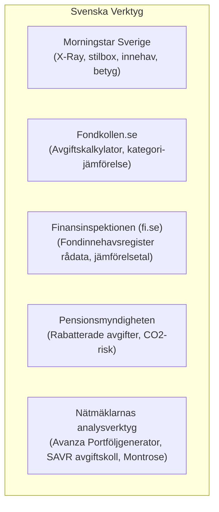
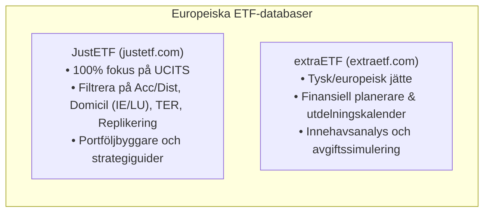

# Research: Jämförelsetjänster och Analysverktyg för Fonder och ETF:er

Status: Kartläggning av svenska och internationella verktyg för avgiftsjämförelse, innehavsanalys, portföljöverlapp och backtesting (som ersätter eller kompletterar nedlagda tjänster som FeeFighters.se).

---

## 1. Executive Summary

När det svenska verktyget **FeeFighters.se** (skapat av forummedlemmen @RobertK på RikaTillsammans) lades ned försvann en av de få tjänster i Sverige som automatiserade analysen av **fondöverlapp** och aggregerade avgifter baserat på Finansinspektionens kvartalsvisa fondrapporter.

För investerare som vill göra motsvarande analyser finns det idag en uppsättning specialiserade verktyg indelade i fyra huvudkategorier:

1.  **Svenska konsument- och avgiftsverktyg:** Morningstar Sverige (X-Ray), Fondkollen (Avgiftskalkylatorn), Finansinspektionens öppna data samt Pensionsmyndighetens fondtorg.
2.  **Verktyg för innehavsöverlapp (*Fund Overlap*):** ETF Research Center (etfrc.com), Morningstar Instant X-Ray och extraETF. Dessa visar exakt hur många bolag två fonder delar och hur stor den verkliga koncentrationsrisken är.
3.  **Europeiska ETF-screeners och databaser:** **JustETF** (Europas ohotade ledare för UCITS-ETF:er) och **extraETF**.
4.  **Kvantitativ portföljanalys och backtesting:** **Portfolio Visualizer** (guldstandarden för Bogleheads och faktorinvesterare), **Curvo Backtest** (optimerat för europeiska UCITS-portföljer) och **Testfol.io** (för hävstångs- och scenariomodellering).

---

## 2. Vad FeeFighters.se gjorde och varför det saknas

FeeFighters.se löste tre specifika problem som traditionella fondlistor inte hanterar:

1.  **Överlappsanalys mellan svenska fonder:** Visade exakt hur mycket samma bolag som ägdes om man kombinerade t.ex. *Avanza Global* (som har Apple, Microsoft, Nvidia) med *Länsförsäkringar Global* eller en teknikfond.
2.  **Transparens i dolda avgifter:** Beräknade den totala verkliga avgiften (förvaltningsavgift + transaktionskostnader + plattformsavgifter).
3.  **Aggregering av ränteparametrar:** Beräknade snittduration och kupongränta för ränteportföljer.
4.  **Datakällan:** Tjänsten använde Finansinspektionens (FI) lagstadgade kvartalsrapporter över svenska fonders samtliga innehav.

---

## 3. Svenska jämförelse- och analysverktyg

### A. Morningstar Sverige (morningstar.se)
*   **Styrkor:** Den globala standarden för fonddata.
    *   *Morningstar Portfolio X-Ray:* Slår samman alla fonder i en portfölj och visar den **aggregerade exponeringen**: verklig fördelning mellan aktier/räntor, geografisk fördelning, sektorvikter, Morningstars stilbox (Large/Mid/Small vs. Value/Blend/Growth) samt de 10 största underliggande aktieinnehaven i hela portföljen.
    *   *Fondjämförelse:* Jämför upp till 5 fonder sida vid sida gällande avgifter, standardavvikelse, Sharpe-kvot och hållbarhetsbetyg.
*   **Begränsningar:** Användargränssnittet på den svenska sajten är föråldrat och gratisfunktionerna för X-Ray har periodvis begränsats eller kräver inloggning.

---

### B. Fondkollen.se (Fondbolagens Förening)
*   **Styrkor:** Oberoende konsumentguide driven av fondbranschens förening.
    *   *Avgiftskalkylatorn:* Visar vad fondavgiften (årlig avgift) faktiskt kostar i kronor över 5, 10, 20 och 30 år med antagen avkastning.
    *   *Kategorijämförelse:* Sorterar fonder efter officiella kategorier (Global, Sverige, Småbolag) med standardiserade avgiftsmått.
*   **Begränsningar:** Saknar verktyg för att analysera enskilda aktieinnehav och visar inte överlapp mellan fonder.

---

### C. Finansinspektionens Fondinnehavsregister (fi.se)
*   **Styrkor:** **Källan till all primärdata.** Svenska fondbolag måste enligt lag rapportera in fondens samtliga innehav (100 % av portföljen, inte bara topp 10) per varje kvartalsslut.
*   **Hur det används:** Rådatan publiceras öppet som Excel/CSV-filer på FI:s webbplats. Det var denna data FeeFighters skrapade och visualiserade. För den tekniskt kunnige spararen går det att ladda ner filerna och köra egna Excel- eller Python-skript för att hitta exakta aktieöverlapp.

---

### D. Pensionsmyndighetens Fondtorg (pensionsmyndigheten.se)
*   **Styrkor:** Det bästa verktyget i Sverige för att se **nettoavgifter efter statliga rabatter** i premiepensionen (PPM). Visar hur fondens ordinarie avgift (t.ex. 0,30 %) pressas ner till t.ex. 0,10 % via Pensionsmyndighetens volymrabatt.

---

## 4. Internationella verktyg för innehavsöverlapp (*Fund Overlap*)

Att veta hur mycket två fonder överlappar är avgörande för att undvika falsk diversifiering (att tro att man sprider risker när man i själva verket köper samma aktier flera gånger).

| Verktyg | Webbadress | Typ av instrument | Gratis / Premium | Viktigaste funktion |
| :--- | :--- | :--- | :--- | :--- |
| **ETF Research Center (ETFRC)** | `etfrc.com/funds/overlap.php` | ETF:er (US & globala) | **Helt gratis** | **Bästa överlappsverktyget.** Jämför 2 ETF:er och visar exakt antal gemensamma bolag och viktat överlapp i procent. |
| **Morningstar Instant X-Ray** | `morningstar.com` | Fonder, ETF:er, Aktier | Freemium / Gratis via vissa partners | Slår ihop en hel portfölj (1–20 fonder) och visar samlad aktieexponering och sektorkoncentration. |
| **extraETF Overlap Tool** | `extraetf.com` | Europeiska UCITS-ETF:er | Freemium | Visar överlapp och dubbelexponering i europeiska ETF-portföljer. |
| **VettaFi / ETFdb Comparison** | `etfdb.com/tool/etf-comparison/` | ETF:er | Gratis | Sida-vid-sida-jämförelse av innehav, kostnader, likviditet och ESG. |

### Exempel på vad ett överlappsverktyg visar (ETFRC):
Mata in **VOO** (S&P 500) och **QQQ** (Nasdaq 100):
*   *Resultat:* 84 av 101 bolag i QQQ finns även i VOO.
*   *Viktat överlapp:* Cirka 45 % av portföljvärdet i VOO utgörs av exakt samma bolag i samma proportioner som i QQQ. Du är alltså kraftigt dubbelexponerad mot Big Tech (Microsoft, Apple, Nvidia, Amazon, Alphabet).

---

## 5. Europeiska ETF-databaser och Screeners (UCITS)

För europeiska och svenska investerare som handlar ETF:er via Avanza, Nordnet eller internationella mäklare är amerikanska ETF-databaser ofta missvisande eftersom de visar icke-UCITS-fonder. Följande två portaler dominerar i Europa:

### A. JustETF (justetf.com)
*   **Marknadsledare:** Det verktyg som Bogleheads och FIRE-sparare i Europa uteslutande använder som referens.
*   **Kärnfunktioner:**
    1.  **Screener med precisa filter:**
        *   *Utdelning:* Ackumulerande (Acc) vs. Utdelande (Dist).
        *   *Replikering:* Fysisk full replikering, optimerad sampling eller syntetisk swap (viktigt för skatteoptimering enligt Section 871(m)).
        *   *Domicil:* Filtrera på irländska (IE) fonder för att säkerställa skatteeffektivitet.
        *   *Avgift (TER):* Hitta marknadens lägsta avgifter (t.ex. SPYL 0,03 %, WEBN 0,07 %).
    2.  **Investment Guides:** Färdiga jämförelseguider för olika index (t.ex. alla ETF:er som följer MSCI World, S&P 500 eller FTSE All-World).
    3.  **Portföljsimulator:** Möjlighet att skapa virtuella portföljer och se historisk utveckling och viktning.

---

### B. extraETF (extraetf.com)
*   **Styrkor:** Mycket stark på portföljuppföljning och analys av kassaflöden.
    *   Innehåller en utmärkt *utdelningskalender* för den som bygger utdelningsportföljer (t.ex. FIRE-uttag).
    *   Avancerad portföljspårare som varnar för obalanser och hög avgiftsbelastning.

---

## 6. Kvantitativ portföljanalys och Backtesting

För investerare som vill testa teorier, analysera riskjusterad avkastning eller simulera uttag finns tre ledande plattformar:

### A. Portfolio Visualizer (portfoliovisualizer.com)
*   **Guldstandarden inom evidensbaserad portföljteori.**
*   **Huvudverktyg:**
    1.  **Backtest Portfolio Asset Allocation:** Historisk simulering från 1972 och framåt. Visar CAGR, standardavvikelse, max drawdown, Sharpe-kvot, Sortino-kvot och marknadskorrelation.
    2.  **Factor Analysis:** Regressionsanalys mot Fama-French 3- och 5-faktormodeller. Visar om en fond verkligen har exponering mot *Value*, *Size* eller *Profitability*, eller om förvaltaren bara tar betalt för vanlig marknadsrisk.
    3.  **Monte Carlo-simulering:** Testar portföljens hållbarhet vid pension/FIRE med tusentals slumpmässiga sekvenser av avkastning och inflation (*Safe Withdrawal Rate*).
*   **Begränsning:** Datan är primärt anpassad för amerikanska tickers och tillgångsklasser (även om vissa internationella tickers fungerar).

---

### B. Curvo Backtest (curvo.eu/backtest)
*   **Byggt specifikt för europeiska Bogleheads.**
*   Löser Portfolio Visualizers svaghet genom att ha full historisk data för **europeiska UCITS-ETF:er** (VWCE, IWDA, EMIM, IUSN, etc.).
*   Simulerar portföljer med:
    *   Månatligt sparande i EUR.
    *   Automatisk återinvestering av utdelningar.
    *   Ombalansering (årlig, halvårsvis eller vid trösklar).
    *   Visar rullande avkastning och djupaste börsfall.

---

### C. Testfol.io (testfol.io)
*   Ett modernt, mycket snabbt och gratis backtestingverktyg som blivit en favorit på Bogleheads och Reddit för **hävstångs- och allokeringsstrategier**.
*   Innehåller syntetiskt förlängda tidsserier (t.ex. 3x S&P 500 och 3x Treasuries simulerade bakåt ända till 1920-talet och 1970-talets inflationskris).

---

## 7. Sammanfattande Rekommendationsmatris

Vilket verktyg ska du använda för vad?

| Ditt analysbehov | Förstahandsval | Alternativ |
| :--- | :--- | :--- |
| **Se innehavsöverlapp mellan 2 ETF:er** | **ETF Research Center (etfrc.com)** | extraETF Overlap Tool |
| **Se samlad exponering för hela fondportföljen (X-Ray)** | **Morningstar Portfolio X-Ray** | extraETF Portfolio Manager |
| **Hitta billigaste europeiska UCITS-ETF:en** | **JustETF (justetf.com)** | extraETF Screener |
| **Räkna på vad fondavgifter kostar i kronor** | **Fondkollen Avgiftskalkylator** | FI:s Jämförelsetal / FINRA Fund Analyzer |
| **Jämföra PPM-fondrabatter** | **Pensionsmyndigheten Fondtorg** | Kollapensionen.se |
| **Historisk backtesting av europeiska ETF:er (UCITS)** | **Curvo Backtest (curvo.eu)** | JustETF Strategy Builder |
| **Avancerad faktormodellering & Monte Carlo (FIRE)** | **Portfolio Visualizer** | Testfol.io |
| **Granska 100 % av svenska fonders råinnehav** | **Finansinspektionen Fondinnehav (fi.se)** | Fondbolagens halvårsrapporter |

---

## Källor och Länkar
- [JustETF – The European ETF Portal](https://www.justetf.com)
- [ETF Research Center – Fund Overlap Tool](https://www.etfrc.com/funds/overlap.php)
- [Portfolio Visualizer](https://www.portfoliovisualizer.com)
- [Curvo Backtest for European Investors](https://curvo.eu/backtest/)
- [Fondkollen – Fondbolagens Förening](https://www.fondkollen.se)
- [Finansinspektionen – Fondinnehav & Jämförelsetal](https://www.fi.se)
- [Morningstar Sverige](https://www.morningstar.se)
