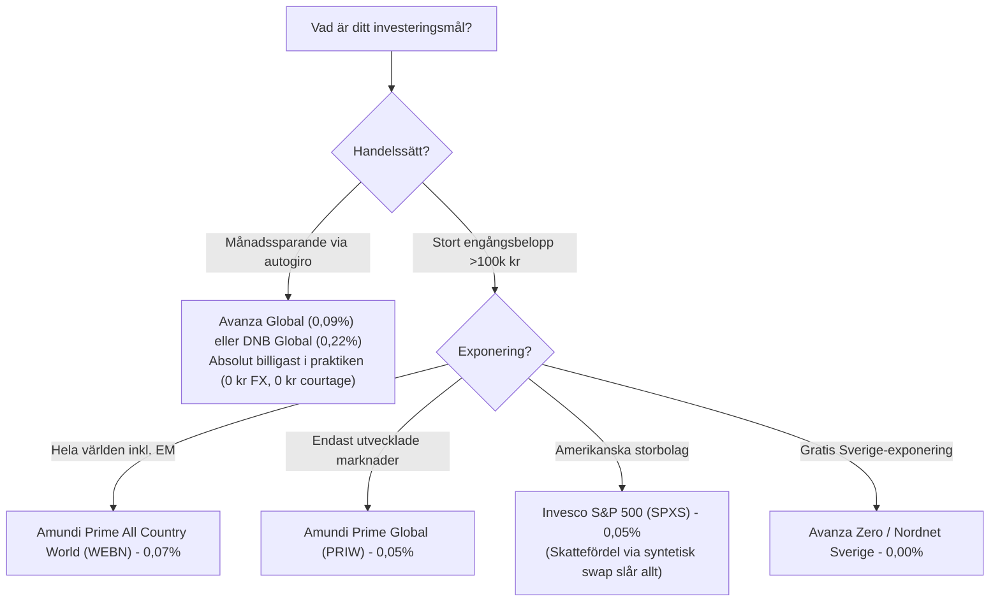

# Research: De Absolut Lägsta Avgifterna och Kostnadsoptimering

Status: Detaljerad kartläggning av marknadens lägsta fond- och ETF-avgifter (0,00 % till 0,09 %), dolda skattefördelar (syntetiska ETF:er och Section 871(m)), samt totalkostnadskalkyler (Total Cost of Ownership - TCO).

---

## 1. Executive Summary

Att enbart titta på den officiella förvaltningsavgiften (TER) på ett faktablad är otillräckligt för att avgöra vad som faktiskt är "billigast". En fullständig kostnadsanalys måste väga samman:
1.  **Nominell förvaltningsavgift / TER.**
2.  **Transaktionskostnader vid handel:** Courtage och valutaväxling (0,25 % hos Avanza/Nordnet, 0,12 % hos Montrose, 0 kr på traditionella fonder).
3.  **Källskatteläckage på utdelningar (*Dividend Withholding Tax*):** Fysiska fonder tappar 15 % i amerikansk källskatt (~0,22 % årlig avbränning), medan **syntetiska (swap-baserade) ETF:er** enligt *US Section 871(m)* erhåller 100 % bruttoutdelning (0 % källskatt).
4.  **Plattformsavgifter och kickback-återbäring** (Fondo, SAVR).

**De absoluta lågprisvinnarna per kategori:**
*   **0,00 % (Helt gratis):** Avanza Zero och Nordnet Indexfond Sverige (OMXS30).
*   **0,03 % (Lägsta aktie-ETF i Europa):** SPDR S&P 500 UCITS ETF (**SPYL**).
*   **0,05 % (Lägsta globala Developed Markets ETF):** Amundi Prime Global UCITS ETF (**PRIW / PABW**).
*   **0,05 % (Största dolda skattefördel):** Invesco S&P 500 UCITS ETF (**SPXS / SP500**) – syntetisk swap ger ca **+0,20 % årlig nettofördel** mot fysiska fonder.
*   **0,07 % (Lägsta All-Country World ETF):** Amundi Prime All Country World UCITS ETF (**WEBN**).
*   **0,09 % (Lägsta traditionella globalfond):** **Avanza Global** (svenskregistrerad fond utan courtage eller valutaväxlingsavgift).

---

## 2. Komplett sammanställning över marknadens lägsta avgifter

| Produktnamn | Typ & Ticker / ISIN | Index | Officiell avgift (TER) | Reell kostnadsprofil (TCO) & Kommentar |
| :--- | :--- | :--- | :--- | :--- |
| **Avanza Zero** | Svensk fond | OMXS30 (30 svenska storbolag) | **0,00 %** | **Helt gratis.** 0 kr courtage, 0 kr växling. Nackdel: Mycket smalt index (endast 30 bolag, saknar småbolag). |
| **Nordnet Indexfond Sverige** | Svensk fond | OMXS30 | **0,00 %** | Nordnets motsvarighet till Avanza Zero. Helt avgiftsfri. |
| **Fidelity ZERO-serien** *(FZROX / FZILX)* | Amerikanska mutual funds | US Total Market / Intl | **0,00 %** | Endast tillgängliga för amerikanska skattebetalare via Fidelitys plattform. |
| **SPDR S&P 500 UCITS ETF** | ETF (IE000XZSV718 / **SPYL**) | S&P 500 | **0,03 %** | **Europas lägsta TER för aktie-ETF:er.** Fysisk replikering. Handlas på Xetra i EUR. Drabbas av 15 % källskatt på US-utdelningar. |
| **Amundi Prime Global UCITS ETF** | ETF (LU1931974692 / **PRIW / PABW / F50A**) | Solactive GBS Developed Markets Large & Mid | **0,05 %** | **Billigaste globala ETF:en.** Fysisk replikering. Exkluderar tillväxtmarknader. Billigare än WEBN för rent DM-fokus. |
| **Invesco S&P 500 UCITS ETF** | ETF (IE00B3YCGJ38 / **SPXS / SP500**) | S&P 500 | **0,05 %** *(men slår index)* | **Bästa nettoavkastning.** Syntetisk swap-replikering. Slipper 15 % amerikansk källskatt via US 871(m), vilket ger ca **+0,20–0,25 % årlig meravkastning** relativt fysiska fonder. |
| **Amundi Prime All Country World** | ETF (IE0003XJA0J9 / **WEBN**) | Solactive GBS Global Markets All Cap | **0,07 %** | **Billigaste All-Country ETF:en.** Täcker både utvecklade marknader och tillväxtmarknader. |
| **Vanguard FTSE Global All-Cap** | ETF (Planerad/bevakad) | FTSE Global All Cap | **0,07 %** | Registrerad i Vanguards prospekt (s. 607). Motsvarar MSCI ACWI IMI (inkl. småbolag) till 0,07 % TER. Lansering/köpbarhet i Sverige bevakas. |
| **Avanza Global** | Svensk fond | Morningstar DM World | **0,09 %** | **Billigaste traditionella globalfonden.** Ingen valutaväxling, inget courtage. Efter att förvaltningen flyttades till Sverige betalas 15 % källskatt (istället för 30 % via tidigare Luxemburg-feeder). |
| **DNB Global Indeks S** *(via Fondo)* | Norsk fond på svensk plattform | MSCI World | ~0,11 % fondavgift + 0,15 % Fondo | Fondo återför fondprovisionen (kickback), vilket sänker DNB:s fondavgift till ca 0,11 %, men Fondos plattformsavgift (0,15 %) gör att totalkostnaden blir ca 0,26 %. |
| **SAVR Global by Vanguard** | ETF-wrapper (VGVF) | FTSE Developed World | **0,15 % totalt** | SAVR erbjuder Vanguards VGVF-ETF paketerad utan courtage och utan valutaväxlingsavgift till en fast årlig kostnad om 0,15 %. |
| **SPDR MSCI ACWI IMI UCITS ETF** | ETF (IE00B3YLTY66 / **SPYI**) | MSCI ACWI IMI | **0,17 %** | Täcker Large, Mid OCH Small Cap globalt (~99 % av marknaden). Fysisk replikering. |

---

## 3. Den dolda skattefördelen: Syntetiska ETF:er och Section 871(m)

Skillnaden mellan nominell avgift och verklig nettoavkastning blir som tydligast vid analys av utdelningsbeskattning på amerikanska aktier:

```mermaid
graph TD
    subgraph Physical_ETF ["Fysisk ETF (t.ex. SPYL 0,03% eller VUSA 0,07%)"]
        P1["Underliggande bolag betalar 1,5% utdelning"]
        P2["USA drar 15% källskatt via skatteavtal (Irland/Sverige)"]
        P3["Nettoutdelning till fonden: 1,275%<br>Skatteläckage: -0,225% årligen"]
        P4["Effektiv kostnad: TER (0,03%) + Skatt (0,225%) = 0,255%"]
        P1 --> P2 --> P3 --> P4
    end

    subgraph Synthetic_ETF ["Syntetisk Swap ETF (t.ex. Invesco SPXS 0,05%)"]
        S1["Swap-avtal mot investmentbank (Total Return)"]
        S2["US H.R. 3221 Section 871(m) undantar breda indexswappar"]
        S3["Nettoutdelning till fonden: 1,500% (0% källskatt)"]
        S4["Effektiv kostnad: TER (0,05%) - Skattefördel (+0,225%) = -0,175%<br>(Slår index!)"]
        S1 --> S2 --> S3 --> S4
    end
```

### Varför Invesco S&P 500 (0,05 %) slår SPDR S&P 500 (0,03 %)
*   En fysisk S&P 500-fond (även med 0,03 % i TER som SPYL) förlorar varje år ca 0,22 % av portföljvärdet i källskatt till amerikanska skatteverket (IRS).
*   En syntetisk swap-fond (som Invesco S&P 500 UCITS ETF) tar emot hela bruttoutdelningen utan avdrag tack vare IRS Section 871(m)-reglerna.
*   **Historisk empiri:** Invesco S&P 500 UCITS ETF har under det senaste decenniet konsekvent presterat **0,15–0,25 % bättre per år än det underliggande S&P 500 Net Total Return-indexet**. Det innebär en "negativ nettoavgift" som ingen fysisk fond kan matcha.

---

## 4. Total Cost of Ownership (TCO): Transaktionskostnader och Brytpunkter

Vid handel från ett svenskt ISK eller en Kapitalförsäkring (KF) påverkas kostnaden drastiskt av handelsvägen:

### A. Handelsavgifter hos svenska nätmäklare för utländska ETF:er
1.  **Valutaväxlingsavgift (FX-spread):**
    *   *Avanza:* **0,25 % vid köp + 0,25 % vid sälj** (totalt 0,50 % tur och retur).
    *   *Nordnet:* **0,25 % vid köp + 0,25 % vid sälj** (0,075 % vid manuell växling på valutakonto, men valutakonto är endast tillåtet på Aktie- och fonddepå samt KF, ej på vanligt ISK).
    *   *Montrose:* **0,12 % vid köp + 0,12 % vid sälj** (Access-nivå).
2.  **Courtage:**
    *   *Avanza / Nordnet:* Minsta courtage för handel på tyska Xetra är ofta 1–9 EUR per nota (ca 12–100 kr beroende på courtageklass).
    *   *Montrose:* 0,15 % courtage (minst 19 kr).

### B. Brytpunktsberäkning: När lönar sig en ETF mot en svensk fond?

Antag att vi jämför:
*   **Alternativ A (Svensk fond):** Avanza Global (0,09 % årlig avgift, 0 kr courtage, 0 kr växling).
*   **Alternativ B (Utländsk ETF):** Amundi Prime Global PRIW (0,05 % årlig avgift).
    *   Skillnad i årlig förvaltningsavgift: **0,04 procentenheter** till ETF:ens fördel.
    *   Transaktionskostnad för ETF:en: 0,25 % köpväxling + 0,25 % säljväxling = **0,50 % totalt** (exklusive courtage).

$$\text{Tid för att tjäna in växlingsavgiften} = \frac{0,50 \%}{0,04 \% \text{ per år}} = \mathbf{12,5 \text{ år}}$$

> **Slutsats av brytpunkten:**
> Vid löpande månadssparande (där courtage och växling betalas varje månad) är det matematiskt omöjligt att räkna hem en ETF på 0,05 % mot en svensk fond på 0,09 %. Fonden vinner med stor marginal.  
> Först vid **stora engångsbelopp (>100 000 kr)** och en **sparhorisont på minst 15–20 år** börjar ETF:ens marginellt lägre löpande avgift att kompensera för valutaväxlingen.

---

## 5. Slutsatser och Strategiska Rekommendationer

1.  **För svenskt löpande månadssparande:** **Avanza Global** (0,09 %) och **DNB Global Indeks S** (0,22 %) är marknadens mest kostnadseffektiva val.
2.  **För stora engångsinsättningar med global bredd:** **WEBN** (0,07 %) är den billigaste All-Country ETF:en, och **PRIW** (0,05 %) är billigast för utvecklade marknader.
3.  **För maximal skatteoptimerad avkastning (USA):** **Invesco S&P 500 UCITS ETF** (0,05 %) är överlägsen fysiska fonder tack vare 0 % källskatteläckage.
4.  **För nolltaxering:** **Avanza Zero** (0,00 %) förblir oslagbar i pris, men bör kompletteras med bredare fonder för att undvika extrem koncentrationsrisk mot 30 svenska verkstads- och bankbolag.

---

## Källor och Dokumentation
- [Amundi ETF: Faktablad för Amundi Prime Global (PRIW) & Prime All Country World (WEBN)](https://www.amundietf.se)
- [State Street Global Advisors: SPDR S&P 500 UCITS ETF (SPYL) Prospectus & KID](https://www.ssga.com)
- [Invesco: Invesco S&P 500 UCITS ETF (SPXS) & IRS Section 871(m) documentation](https://www.invesco.com)
- [Avanza Bank: Prislista och faktablad för Avanza Global och Avanza Zero](https://www.avanza.se)
- [Finansinspektionen: Regler för källskatt och jämförelsetal för fondavgifter](https://www.fi.se)
